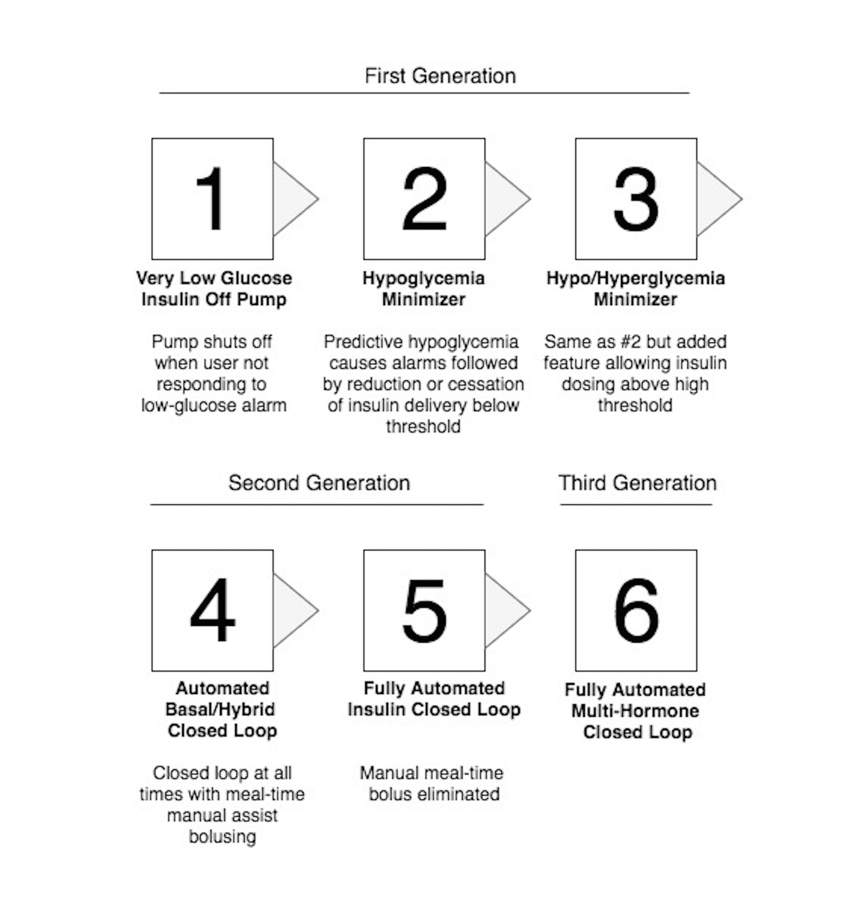
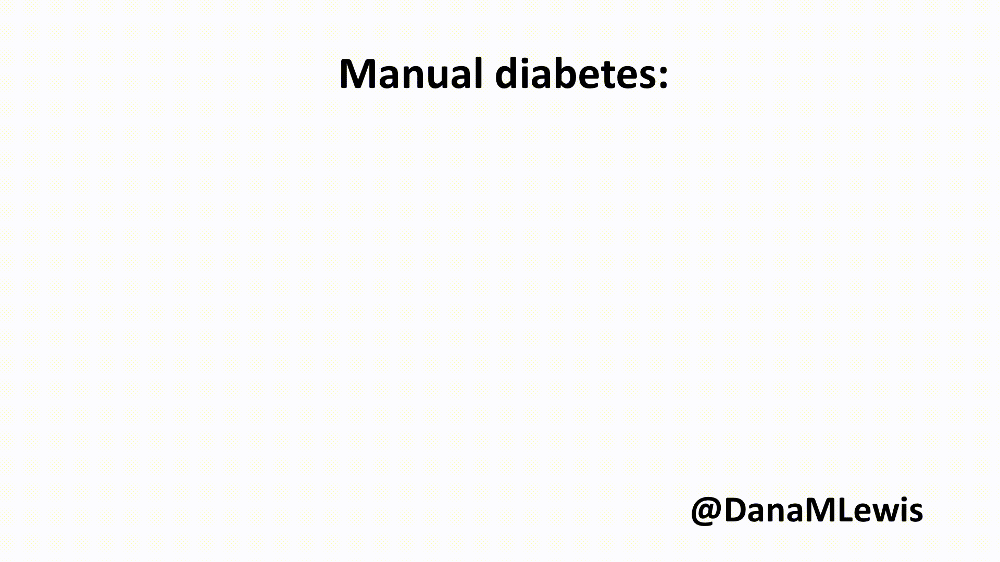
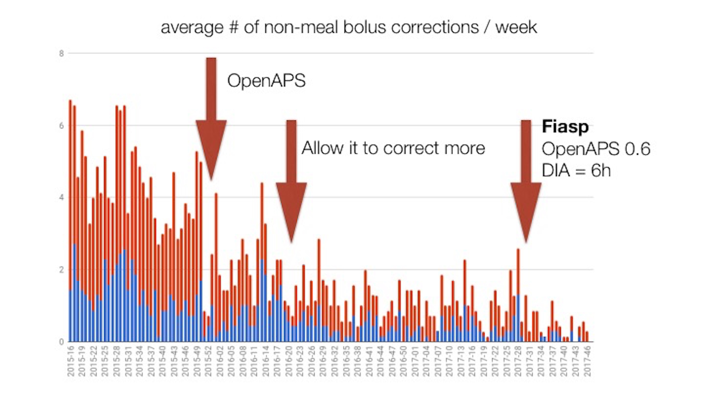
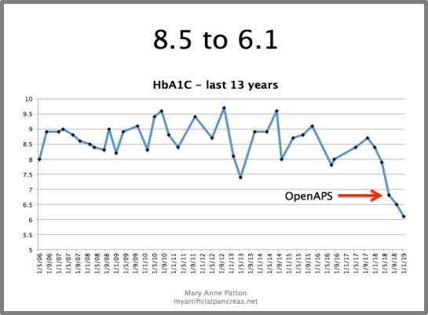
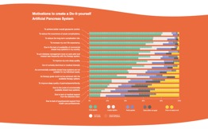

# 1. What’s a closed loop or artificial pancreas system, and why would someone use one?

## Different names for the same technology

You’ll hear a variety of terms used for the same general type of technology. Artificial pancreas \(AP\) or “artificial pancreas system” \(APS\) is one name. “Looping” is a shorthand name used for “closed looping” \(but can also refer to ‘open’ looping as well\). The FDA, among others, like to call them “automated insulin delivery” \(AID\) systems. Some people talk about “hybrid” vs “fully automated” closed looping. And to differentiate between self-built, do-it-yourself \(DIY\) systems, you’ll see “DIY” prefaced in front of those words to differentiate from commercial types of technology.

To help understand the different names you may encounter, you can see this visual made by JDRF years ago to describe the progression in technology:

* **Stage 1:** low glucose suspend. When your glucose passes a certain low threshold, insulin is reduced or suspended.
* **Stage 2:** predictive low glucose suspend. When your glucose is predicted to pass a certain low threshold, insulin is reduced or suspended.
* **Stage 3:** hybrid closed loop. When your glucose is predicted to pass a certain low threshold, insulin is reduced or suspended, and when your glucose is predicted to pass a certain ‘high’ threshold, insulin is increased.
* **Stage 4:** also hybrid closed loop.
* **Stage 5:** fully automated closed loop. No manual mealtime entry required.
* **Stage 6:** fully automated multi-hormone closed loop.

As you can guess, this image was created over a decade ago. \(JDRF first started talking about and funding their “Artificial Pancreas Project” in 2006\). Now, stage 3 & 4 are essentially the same thing, and are both considered to be standard “hybrid” closed looping, and is the current reality of commercial closed loop systems coming to market in the next several years.

However, would you believe that stage 5, or ‘fully automated’ closed looping is already a reality for some people in the DIY APS world?

## Choose one - what would you give up if you could?

What do you have to do today \(related to daily insulin dosing for diabetes\) that you’d like to give up if you could? Counting carbs? Bolusing? Or what about outcomes – what if you could give up going low after a meal? Or reduce the amount that you spike?

**How many of these 5 things do you think are possible to achieve together?**

* No need to bolus 
* No need to count carbs Medium/high carb meals 
* 80%+ time in range  no hypoglycemia

How many can you manage with your current therapy and tools of choice? How many do you think will be possible with hybrid closed loop systems?

With just pump and CGM, it’s possible to get good time in range with well-timed meal boluses, counting carbs, and eating relatively low-carb \(or getting lucky/spending a lot of time learning how to time your insulin with regular meals\). Even with all that, some people still go low and have hypoglycemia. So, let’s call that a 2 \(out of 5\) that can be achieved simultaneously.

With a first-generation hybrid closed loop system in the DIY community like the original OpenAPS oref0 algorithm \(first released in early 2015\), it’s possible to get good time in range overnight, but in order to achieve that for meal times would still require bolusing and counting carbs. But with the perfect night- time BGs, it’s possible to achieve no-hypoglycemia and 80% time in range with medium carb meals \(and high-carb meals with Eating Soon mode etc.\). So, let’s call that a 3 \(out of 5\).

With some of the advanced features we added to OpenAPS with oref0 \(like advanced meal assist or “AMA” as we call it\), it became a lot easier to achieve a 3 with less bolusing and less need to precisely count carbs. It also deals better with high-carb meals, and gives the user even more flexibility. So, let’s call that a 3.5.

However, in early 2017, when we began discussing how to further improve daily outcomes, we also began to discuss the idea of how to better deal with unannounced meals. This means when someone eats and boluses, but doesn’t enter carbs. \(Or in some cases: eats, doesn’t enter carbs, and doesn’t even bolus\). How do we design to better help in that situation, all while sticking to our safety principles and dosing safely?

In order to better help in those situations, we designed some new components of the algorithm \(including a way to “supermicrobolus” and safely front-shift insulin activity by borrowing from future basals\).

With these features enabled, it is possible to achieve a solid 4 out of 5. **And not just a single set of 4, but any 4 of the 5** \(except we’d prefer you don’t choose hypoglycemia, of course\):

* With a low-carb meal, no-hypoglycemia and 80+% time in range is achievable without bolusing or counting carbs.
* With a regular meal, the user can either bolus for it or enter a rough carb count / meal announcement and achieve 80% time in range.
* If the user chooses to eat a regular meal and not bolus or enter a carb count, the BG results won’t be as good, but the system will still handle it gracefully and bring BG back down without causing any hypoglycemia or extended hyperglycemia.

That is huge progress, of course. And we think that might be about as good as it’s possible to do with current-generation insulin-only pump therapy. To do better, we’d either need an APS that can dose glucagon and be configured for tight targets, or much faster insulin. The dual-hormone systems currently in development are targeting an average BG of 140 mg/dL, or an A1c of 6.5, which likely means more than 20% of time spent above 160 mg/dL. And to achieve that, they do require meal announcements of the small/medium/large variety as well.

Fiasp is promising on the faster-insulin front, and has allowed some users to choose completely unannounced and un-bolused meals, but it’s probably not fast enough to achieve 80% time in range on a high-carb diet without some sort of meal announcement or boluses. However, 4 out of 5 isn’t bad, especially when you get to pick which 4, and can pick differently for every meal. This is what we are achieving with DIY APS, which are essentially second-generation systems - and we hope \(and expect that\) the same type of flexibility in choices and outcomes will be possible with second-generation commercial systems as well.

## How APS works

Whether we’re talking DIY or commercial systems, hybrid or fully automated systems, they all essentially work the same in terms of their most basic functionality.

This type of technology makes small adjustments every few minutes to provide more or less insulin with the goal of keeping blood glucose \(BG\) levels in a predefined target range. It does so with the following components: an insulin pump, a continuous glucose monitor \(CGM\), and a controller.

In “manual” diabetes mode, you as the human are the controller. You look at information from your pump and CGM, do some mental calculations, and decide what to do. And you do it over and over again, all day, every day.

In “automated” diabetes, a computer functions as the controller in the middle of the system. It reads from the pump and CGM, does calculations based on your settings, makes predictions about what might happen, and changes insulin dosing in order to change the predicted outcomes to your blood glucose levels.

A computer is much better suited to be the “controller” than we humans. We humans have lives to live, jobs to work, the need to sleep, etc. As a result, even the most attentive human will sometimes take a break or do something else and not be able to constantly track BG levels. A computer can be told to watch for every new incoming BG data point, every five minutes, and re-calculate and re-adjust accordingly.

Another reason a computer works so well in an APS is that diabetes is complicated and has numerous, incalculable factors that we have to respond to - but can’t always count or track. For example, stress and adrenaline and excitement may influence your BG levels, as does activity and exercise. But sometimes they may make your BG rise, and other times your BG will drop. Sometimes it’s instantaneous, and sometimes it may happen hours later. It can be hard to predict and adjust for manually. So it’s better to wait and see what happens, and make constant adjustments, but we humans don’t have the time or patience for that.

Additionally, insulin is not instantaneous. Modern “rapid” acting insulin peak around 60-90 minutes, and have a tail that still influences your body 6-8 hours later. That can be hard to keep track of. Modern pumps’ bolus wizards attempt to help with that, but they don’t take into account temporary basal rates that may have adjusted your insulin delivery or time spent suspended \(because you were swimming or showering\). Training the controller to track the insulin activity curves and both the negative and positive impact of more or less insulin delivered compared to your body’s normal is a lot easier than us humans doing the task constantly!

In other words, diabetes is hard. It’s constant. It’s unrelenting. A computer will watch carefully, constantly, and be able to respond more quickly than a human does in most situations to fluctuating blood glucose levels. And if it’s unable to respond enough in an extreme situation, it can be designed to alert you to the need for more insulin or carbohydrate intake.

Different closed loop systems will require different levels of interactions from you as a human. Depending on your goals and preferences, that may influence both your choice of what type and brand of system to use, and it also may influence your choices in how you interact with that system over time.

## Analogies for understanding the impact of APS on living with type 1 diabetes

### _A newborn baby_

When I try to describe the impact of APS to people who don’t have a close knowledge of type 1 diabetes, I first have to start by giving them a better understanding of type 1 diabetes. And not just “the pancreas no longer produces insulin”, but an understanding of living with type 1 diabetes. This means giving them an analogy for how much diabetes can disrupt and take energy away from normal life activities. It doesn’t always, but it can.

The best analogy I’ve found that resonates with a lot of people is that of a newborn or young baby. Babies need care, feeding, holding, etc. every few hours. It doesn’t matter if you are tired and want to sleep: they may wake you up by crying so you can take care of their needs. Sometimes the usual things work to check and solve the problem: you can feed them, and they’ll go back to sleep. You can change their diaper, and they’ll go back to sleep. Sometimes you’re mystified and nothing’s working and the baby won’t stop crying, so you can’t go back to sleep. Even on a “good” night, you’re still being woken up. You have sleep deprivation, and you’re exhausted.

With type 1 diabetes, it’s like a newborn baby that never, ever grows up. In the middle of the night, your blood sugar level may drop. It could be from a number of reasons, such as exercise the day before. Your blood sugar may rise, due to delayed carbohydrate absorption or a late-night dinner. It could be from a hormone surge from dawn phenomenon, or a growth spurt. It could be because your menstrual cycle is approaching. For any number of reasons, your blood sugar could be out of range, and it may wake you up - either from your CGM alarming, or because the symptoms of the high or low wakes you up. You may have to wake up enough to think through what you need to do. It may be a quick fix, or it could involve staying up a while until your BG levels normalize. And there is no cure for type 1 diabetes, so this is the reality from diagnosis onward.

With an APS, it’s like having a “night nanny” for diabetes. When your BG starts to rise or drop, the APS will respond and do everything it can to take care of the problem for you. It might still need to wake you up, but instead of several times a week being woken up in the middle of the night - and in some cases multiple times per night - you might experience only having to wake up once a month, or once every six months. The difference can be huge - and that’s just talking about the nighttime aspects of living with type 1 diabetes!

### _Spoon theory_

The other analogy that sometimes resonates is that of “spoon theory”. It’s a concept used in the chronic illness community to help describe how much energy and work it may take to just live regular life while dealing with the chronic illness, and originally coined and described by Christine Miserandino \([read more about it here](https://butyoudontlooksick.com/articles/written-by-christine/the-spoon-theory/)\). 

Think of it this way: you may have five “spoons” for a typical day. On a good day, it may take one spoonful of energy to do all your diabetes-related task. That may leave you a spoon for going to the gym and working out, a spoon for work, a spoon for playing with your kids, and a spoon to spare for something else. On a day after you were woken up twice overnight to deal with low blood glucose levels, it may take two spoons’ worth of energy, leaving you with only three spoons for the rest of your day. If it’s a typical day, it might be ok. But what if it’s a day where you need two spoons for work, or your kids need more spoons, etc.? It can make it hard to do everything, or even to just function “normally” throughout your typical day.

You could also think of it in monetary terms. What if you had one dollar \($1\) to spend every day on things you loved doing? What if diabetes normally “costs” forty cents \($0.40\) to do the other activities you loved? If APS could give you back thirty cents \($0.30\), what else could you do with that time, energy, and better health?

## Why people may choose to use APS

There are numerous reasons why people may choose an artificial pancreas system.

My reason, as I indicated in the preface, is around sleep: I want to be able to sleep safely and with peace of mind. There is nothing better for me than a long \(say, 10-12 hours\) night of sleep with my blood glucose levels staying within target range all night long. Some people have been able to achieve this on MDI or standalone pumping - I never was able to do this consistently due to my changing activity patterns. I also appreciate the security of having the system, day or night, responding to any fluctuations in BG levels for whatever reasons.

That’s not the only reason people choose APS technology. Some people choose it because they can achieve the same goals \(A1c\) with much less work. Sulka Haro & his family do a great job of articulating this, because they were able to count their manual records of how many treatments they did on a daily basis for their son’s type 1 diabetes. Before starting OpenAPS, they made an average of 4.5 manual insulin dosing corrections per day. \(Can you imagine the work to chase a young toddler around all day and ask them to eat when they don’t want to, or stay still long enough to bolus on their pump?\) That number doesn’t include routine actions like meal-boluses and carb corrections. After OpenAPS and choosing their preferred features and algorithm adjustments over time? They now do less than an average one manual insulin correction per day. It’s a huge reduction in the amount of work they have to do, while achieving the same A1c as before.

Another story I think is valuable to share is the Wittmer family’s story. Jason Wittmer built an OpenAPS rig for his son. Katie Wittmer also happened to work in the school district, so they were able to gain access to the records of the number of times their son had to go to the school nurse. In 4th grade, before OpenAPS, he had to go to the school nurse’s office - and leave class and his peers - 420 times in the school year. That’s an average of 2-3 visits per day. 354 were “routine” visits for pre-lunch or pre-gym checks. 66 were visits for hypo- or hyperglycemia. Compare that to their 6th grade experience: he only visited the school nurse five times. \(Three of the visits were from gym-associated hypoglycemia; two were malfunctions from the CGM or OpenAPS rig where he needed help troubleshooting\).

The primary motivation for most people using DIYAPS is to improve glycemic control, and sometimes the improvements can be dramatic.

Mary Anne Patton describes her experience starting OpenAPS after 38 years living with type 1 diabetes, in her blog, [myartificialpancreas.net](http://myartificialpancreas.net). She says OpenAPS gave her the tools to see, for the first time, how her extreme insulin sensitivity and blood glucose volatility had led her to develop compensatory behaviors to avoid hypoglycemia, and that these were affecting her glycemic control. She graphed her last 13 years of A1c results, and showed the point at which she started on a DIY APS.

One good overview of peoples’ motivations for choosing DIY systems, which is likely to be similar to the reasons people have for choosing commercial systems, comes from a survey done in the DIY community via the OPEN research collaboration, of which I am a part. This is a grant-funded initiative to study the open source diabetes space. The survey was presented at ATTD 2019. Some of the top responses about motivations were around reducing short- and long-term complications of diabetes. I appreciate this survey because it allowed us to differentiate between the choices and responses of individuals \(adults\) with type 1 diabetes, compared to caregivers’ \(parents and/or spouses\) choices of motivations. For caregivers, their own sleep is usually a key driver of choosing an APS solution.

It may not matter what other people’s reasons are, though. Everyone is different: our diabetes may be different. Our lifestyles are different. Our goals, choices, and preferences are different. So at the end of the day, it’s a personal decision about whether or not you’d like to use an APS, and which APS you’ll choose to use.

