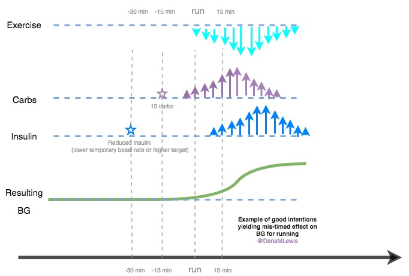

# 6. Turbulence and Issues When Looping

To continue using my favorite analogy related to flying and autopilot, it also means we have to talk about turbulence and things that can disrupt you from looping. Like the things that can prevent looping in the first place, there are things that can throw off your looping.

## Compression lows

I already mentioned wonky sensor data that may mean either a blip in your looping time, or may prevent your insulin dosing from being automatically adjusted. Again, your sensor life and your calibration practices will likely change with looping. But there are also common issues like “compression lows”. This can happen when your sensor is physically compressed by laying on it or leaning up against something. This can reduce the fluid flow around the sensor, causing the sensor to detect that there’s less glucose. On your CGM graph it can look like a sharp, drastic fall toward a low BG. It’s common for there to be two or three data points with a huge, sudden drop, then maybe missing data. Eventually, the data will likely resume on the same trend line as before the drop started. If your APS requires you to have a certain number of continuously recorded data points from your CGM, recovering from a compression low may mean that you won’t be looping for a while. It’s helpful to know what to expect, so you know what you can - or can’t do - to deal with the situation of wonky CGM data.

## Body sensitivity changes

But the other big disturbance, so to speak, is around body sensitivity changes. You know all the ways it can happen: you’re getting sick, recovering from getting sick, getting ready for/or are on/or are right after your period, or have an adrenaline spike, or have hormones surging, or have a growth spurt, or just exercised, etc.

This is what makes diabetes oh-so-hard so often. But this is where different closed loop systems can help, and one area in particular you should ask about when picking a system: how does it adjust and adapt to sensitivity changes, and on what time frame?

In the DIY world, we’ve developed a number of techniques to deal with changes in body sensitivities. In OpenAPS and AndroidAPS, we use a feature called “autosensitivity”. It looks back at what was expected to happen compared to what did happen over the most recent 8 and 24 hour time periods. It then calculates whether you’re running sensitive or resistant - compared to your normal, and creates a ratio as a proxy for how sensitive or resistant you are. That ratio is then used to adjust the calculated insulin needs accordingly. This means it will respond to changes in sensitivity over a short time period automatically, and not require any human intervention to detect changes over those time periods.

For shorter time periods - say, you just started throwing up from food poisoning or norovirus, and you know with 100% certainty that you are suddenly and very differently more sensitive to insulin. In that case, you’d likely want to temporarily use a “profile switch” to change your settings. This is common in AndroidAPS \(and eventually might be added to Loop\) to enable people to switch their profiles to pre-configured amounts different from their usual basal rates, ISF, and carb ratio. In OpenAPS, and likely with some commercial systems you can accomplish the same thing using a high temporary target. Making precise profile adjustments can be hard to do, though, if you don’t know what is happening or why, and how much you need to adjust your settings by. Ideally, your APS will automatically detect and respond to changes, but it may take some time to pick up on those changes. In the meantime, you may want to instruct the system to behave more conservatively until everything settles out.

Growth spurts and hormone-related insulin changes for things like menstrual cycle and different stages of pregnancy also cause changes to insulin needs. One of the DIY tools, Autotune, which we already mentioned in the “Getting Started” chapter, can help you make more frequent changes and stay ahead of the settings changes you may need for those scenarios. Hopefully there will be more tools, and guidelines for different scenarios, in the future as APS becomes more broadly tested over a larger and more diverse population of people living with diabetes.

There are also issues related to food digestion: things like acute onset sickness like food poisoning, norovirus, or the flu can all cause you to throw up, or things like gastroparesis can cause intermittently slowed and unpredictable digestion. This can be problematic if your algorithm isn’t designed to have a dynamic carbohydrate absorption model. If you frequently experience these issues, it’s worth exploring to see if a different algorithm has a different way of dealing with dynamic absorption of food that gives you different outcomes. The difference between a dynamic and a static model \(which assumes all carbs are equal and will hit at the predicted time, no matter what\) can be significant.

## Exercise and changing activity levels

Exercise and activity can be the other major source of turbulence of looping. There are a few reasons why this is the case. First, remember that insulin does not act instantaneously. The insulin can be hitting peak activity at the time of your activity, which can contribute to a major low during your exercise \(or after\). Additionally, exercise can increase your insulin sensitivity both during and also hours after your exercise. On the flip side, not all exercise will send you low. Certain types of activities can actually drive your blood glucose up - especially things like sprinting or other activities where you are pushing yourself past your current comfortable level of fitness. All of this combined makes exercising with diabetes hard. And an APS makes it easier, but there are still challenges.

Hopefully, your APS will be like the DIY systems and allow the setting of different temporary targets. These are important not only for during and after your activity, but also before your activity commences. You don’t want to go into exercise with a lot of insulin on board. Think about the timing - if you eat lunch and bolus, then go for a walk an hour later, that insulin is peaking at the time of your walk. Additionally, the insulin can have an increased effect due to your extra activity from your muscles. Finally, exercise can also delay and slow digestion, so even if you have a meal on board, this can all contribute to a low \(and a rebound later when digestion of the meal resumes\).

### An example of good intentions but misunderstanding the timing

I have a pretty good example of how it took me several years to finally understand how much the timing of everything matters for exercise. In 2013, I decided to run a marathon. I wasn’t a runner before, so I was actually starting from step zero in terms of learning how to run: increasingly my running distances, and figuring out how all to do this with diabetes. \(And this was before I had built OpenAPS, so I was figuring it out the hard way!\)

I worried about going low during the runs. I generally would set a low temporary basal rate to reduce insulin during the run, and try to run before dinner instead of after \(to reduce the likelihood of running with a lot of active insulin in my body\). I would also eat some kind of snack for energy as well as making sure I didn’t go low. I would also carry a bottle of Gatorade to drink along the way in case my blood sugar dipped.

And here’s what happened:

Per the visualization, the carbs would hit in about 15 minutes. If I reduced insulin at the time of the run, it would drive my blood sugar up as well, over a longer time frame \(after around 45+ minutes as the lack of insulin really started to kick in and previous basal impact tailed off\). The combination of these usually meant that I would rise toward the middle or end of my short and medium runs, and end up high. In longer runs, I would go higher, then low – and sip Gatorade, and have some roller coaster after that.

In the past year \(beginning in 2018\), I started running more again. This time, I had OpenAPS and was armed with a lot more knowledge and visibility into what was going on. I realized that if I was running in the afternoon or evening, the most important thing to do was to set a higher temporary target \(e.g. “activity mode”\) well before I went out for a run. This could be an hour or two hours before I ran, depending on how much IOB I had at the time. This helped OpenAPS know to reduce insulin accordingly, cutting down on the pool of super-active IOB I had at the start of my run. I also stopped proactively taking carbs \(unless I wasn’t able to get below about 0.75U of IOB before I started\), and just used carbs during the run if I started dropping. It made a big difference, and I was able to run distances around half marathons without any lows and without needing many supplemental carbs to ward off lows, either.

## Post-exercise sensitivity matters, too

There are numerous ways that you’ve likely learned in manual mode to deal with post-exercise sensitivity. Thankfully, an APS can do most of the heavy lifting and dealing with the hard part of not knowing when or how much sensitivity will be impacted. When comparing and choosing APS and talking about people’s experiences, if you’re someone who does a lot of activity, don’t forget to ask people about how well their system deals with post-exercise sensitivity changes. There are certain things you can do manually to alert your system to impending sensitivity changes - such as setting a longer, higher temporary target in our system, but you’ll want to pick a system that allows you to do that, and a system that can respond to shorter-term sensitivity fluctuations and not one that takes days to “learn” there’s been a change.

## Disconnecting from your pump

Disconnecting from your pump for any reason - during a shower, for a swim, etc. - can be a major source of turbulence in your BG levels, even with an APS level. Why? Well, if your BG starts rising, you don’t have the pump on so the APS can’t provide you with more insulin. It’s back to manual mode, where you have to decide to do a correction bolus, reconnect your pump and enable your APS, or otherwise deal with the situation. The other reason it can be challenging is again due to the timing of insulin.

If you’re off of your pump for a two hour swim and your BG starts rising, you may decide to reconnect your pump and do a manual correction bolus. However, you’ve missed two hours of basal insulin. Your bolus will take ~60+ minutes to start hitting peak activity - so you will likely see your BG rise for another hour before the insulin takes effect. It doesn’t matter how good your APS is: it’s only as fast as correcting for rising BGs as the insulin can take effect.

As a result, you may decide to reconnect periodically and do some small boluses to substitute for basal insulin, in order to keep a little bit of insulin going in your body. You may decide to switch APS’s \(or pumps\) temporarily to one that is waterproof, if yours is not. And some people even choose to swap back to MDI \(or at least injected basal insulin\) for long pool/beach related vacations.

## Sickness or surgery

As you live real life with your APS, you’re still human - and if you’re like me, your autoimmune system is still a tad over-reactive and you may find yourself getting sick from time to time. Not diabetes sick \(e.g. not feeling well because of a high or low\), but “normal people” sick with the flu or another virus.

Again, it’s helpful to know what your system can do. Ideally, your APS will roll with whatever life throws at it.

I’ve certainly thrown a lot at mine!  

In my experience, OpenAPS has successfully handled the following:

* [Receiving norovirus from my nephew,](https://diyps.org/2016/12/01/sick-days-with-a-diy-closed-loop-openaps/) and spending three days of not eating at all - but not having a single hypoglycemic/low BG reading \(and also no hyperglycemia, or highs\)
* [Getting the flu](https://diyps.org/2018/01/28/quantified-sickness-when-you-have-openaps-and-the-flu/) and following it with weeks of bronchitis and having excessive insulin resistance and reduced activity
* Falling off a mountain in a foreign country and breaking my ankle in three places, then getting home and breaking a bone in my other foot a week later
* Jet lag from traveling 12 hours’ worth of time zones away and dealing with sleep deprivation from missing several nights’ of sleep due to red-eye flights

... just to name a few of the most extreme!

When I say successfully, I don’t just mean the outcomes \(same time in range as if I was healthy\), but I also mean the amount of work it required to obtain those outcomes. [When I fell and broke my ankle](https://diyps.org/2019/02/12/broken-bones-trimalleolar-ankle-fracture-type1-diabetes-and-openaps-danamlewis/), I was incredibly stressed and in the most pain I’d ever been in my life. I was concerned about having broken bones, I was being winched off a mountain and evacuated in a helicopter to a hospital in a foreign country - by myself, and I wouldn’t see Scott \(my husband\) until he safely hiked out of the trail the following day. I had very little extra energy - and pretty much no extra brain cells - for dealing with diabetes. I had to take zero extra actions with OpenAPS during that entire time period, and weeks later into my recovery. It didn’t matter that I stopped moving \(and maybe got 10 steps a day, just crutching to and from a bathroom\) and stopped eating, or ate more here and there. It didn’t matter that I was suddenly eating three times the amount of protein that my body was used to - OpenAPS was able to respond, no matter why. Even when I caught a cold from my nephew, and also had my menstrual cycle at the same time, while dealing with everything else... I didn’t have to do any extra work diabetes-wise. It’s a huge difference to how things would be if I was having to handle everything in manual mode.

We’ve also had stories from other APS early adopters in the community, too, around sickness and also surgery. People have had brain surgery, spine surgery, hand surgery, emergency surgeries, and more with APS running before, during, and after their surgeries. Not all surgeons and anesthesiologists are ready to have patients looping during surgery - but several are open to it, so if you find yourself needing to have surgery, it’s worth discussing with your medical team. There may not be formal protocols in place, yet, but you can agree upon a protocol including what targets your APS should be using before, during and after surgery, as well as what to do if the system fails, and how the nursing team and others will interact with you and your diabetes differently as a result.

Remember, as always, that your APS is not a cure. You still may have hypo- or hyperglycemia when sick and dealing with things like broken bones, surgery, or recovery. However, your APS should be able to help carry some of the weight of dealing with and responding to fluctuating glucose levels. And the more time you spend in range, the easier it will be for your body to do the rest of its necessary healing.

