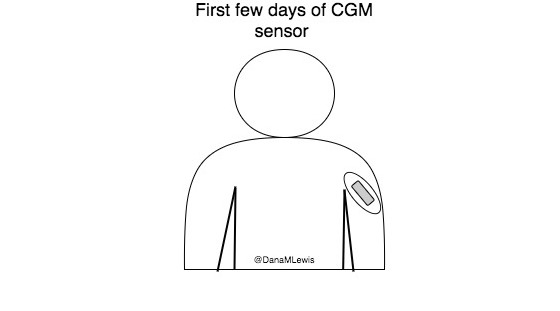
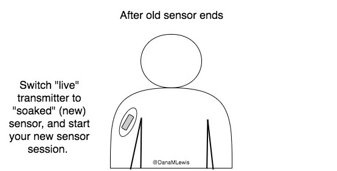

# 7. Preparing For Your Next Looping "Session"

Unfortunately, it’s not always possible to loop exactly 100% of the time. The chief reason for this is that you at some point will need to change your CGM sensor \(or it’ll fall out and you have to replace it\). Remember, no sensor data means no looping. Just like you’ll want to plan how you will start on the closed loop, you’ll want to plan for how to cycle off and then back on again. Depending on your system, there may be things you can do to smooth things out and limit the downtime of your looping sessions.

## “Pre-soak” your CGM sensor if possible

One of the things I do to get better first day results from my closed loop is to pre-soak a CGM sensor to skip the first day jumpy numbers. It makes a big difference for the first hours back on a “new” looping session because it’s actually the second ‘day’ of the sensor, and it’s settled in somewhat.

Normally, you’d expect to see a person with one CGM sensor on their body, like this:

However, 12-24 hours before I expect my sensor to end \(or I plan to end the sensor, if it’s been restarted already\) I insert my next sensor into my body. To protect the sensor \(you don’t want the sensor filament itself to get torn off or lost in your body\), I plop an old \(“dead” battery\) transmitter on it. If you don’t have an old/dead transmitter, you could try taping over it – the goal is just to protect the sensor filament from ripping. Some people also do fine without covering it - YDMV as usual.

The next day, when my sensor session ends:

* I take the “live” transmitter off the old sensor, and remove the old sensor from my body. I hit “stop sensor” on my receiver, if it hasn’t already stopped itself.
* Gently remove the “dead”/old transmitter from ‘new’ sensor. I then stick the “live” transmitter onto the new sensor.
* I hit “start sensor” on my receiver.

The outcome \(for me\) has always been significantly improved “first day” BG readings from the sensor. This works great when you can plan ahead and your outfits \(don’t judge, sometimes you have important outfits like a wedding dress to plan around\) and skin real estate support two sites on your body for 24 hours or so.

This doesn’t work if you rip a sensor out by accident, so in those scenarios I go ahead and put a new sensor on, put the ‘live’ transmitter on, and hit ‘start’ to get through the 2 hour calibration period as soon as possible to get back to having live data. \(All the while knowing that the first day is going to be more “meh” than it would be otherwise.\)

Depending on your system \(both APS and your CGM and your CGM software of choice\), you may be able to “restart” or “renew” your sensors without a warmup time period. Some commercial sensors will have a longer life, and/or you may not want to \(or be able\) to restart them. However, “soaking” your next one has always helped, and never hurt, and may be a good strategy to add to your toolkit to minimize downtime from looping.

## Planning for your CGM and looping downtime

Even if you can’t pre-soak your CGM sensor you can do some other general planning ahead – like making sure your looping session doesn’t end in the middle of a big meal that’s being digested, or overnight. Those are the times when you’ll want to be looping the most.

I aim to avoid the following situations:

* Pay attention to when my CGM sensor “ends”, and sometimes restart it earlier than it’s supposed to die, so the CGM “restart” time period isn’t during a meal, exercise, or overnight
* Try not to eat a meal, and definitely not a large carb-filled meal, during the time when my CGM is warming up. This is for two reasons:
  * I don’t have visibility into what’s going on after the meal.
  * My APS can’t help out since I don’t have data, so I’m in manual mode and without visibility.

I also try to check when my sensor is inserted and figure out what exactly 7 \(or 10 or 14, depending on which sensor\) days ahead will be. Where will I be? What will I be doing? If I’m at home and not traveling, and it’s during the day or evening, it’s less of a big deal. If my sensor start time will come at a time where I’m supposed to be on an airplane, I’ll set a calendar reminder for a time before \(often the night or day before\) to remind me to change or restart my sensor so I have a working CGM and a working APS during my travel.

Similarly, I check for what time zone I’m going to be in for the future. If I’d normally be home, but it’s 3am in the country I’ll be visiting next week, I do the calculations and figure out the time where it will be the least hassle in the middle of my trip to restart or change my sensor. You may be like me if you’re a frequent traveler and especially across many time zones and decide that sometimes it’s worth a little less use out of a particular sensor to trade off from having to deal with the sensor and changing or restarting it during a busy trip.

## Learning from your looping session

Just like learning to fly, where you take a lot of training flights and review how the flight went, you’ll want to think about how things went and what you might change behavior-wise for your next looping session. Some of the things that may change over time as you learn more about your tech of choice:

* Timing of meal announcement or boluses
* Precision \(if needed, or otherwise lack thereof\) around carb counting
* Using things like “eating soon” mode to optimize meal-time insulin effectiveness and reduce post-meal spikes \(see more about this in the next chapter\)
* Using different activity patterns and targets to get ideal outcomes around exercise

## Tweaking underlying settings \(if you can\)

You’ll probably spend more time at the start of your looping journey reviewing your settings and figuring out how things went each time, plus what you might want to change. It’s not so different to life overall with diabetes - we’re constant tinkerers, experimenters, and scientists. Our bodies and lifestyles are always changing, so we are constantly needing to evaluate what worked, what might have changed, and how we need to respond accordingly. Again, while we have new tech to help, this also throws in new variables for us to experiment with. To help prevent feeling overwhelmed, consider picking one new thing to experiment with each time. Then you can evaluate how it went, decide to continue with the change \(or adjust it further\), or change back and try something else different.

