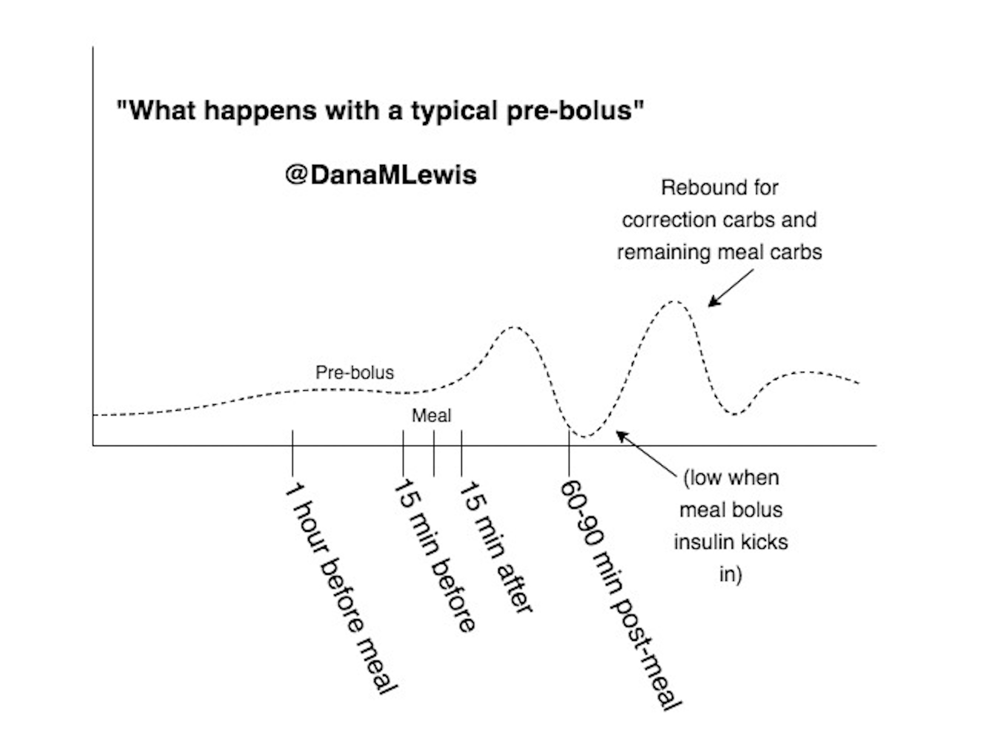
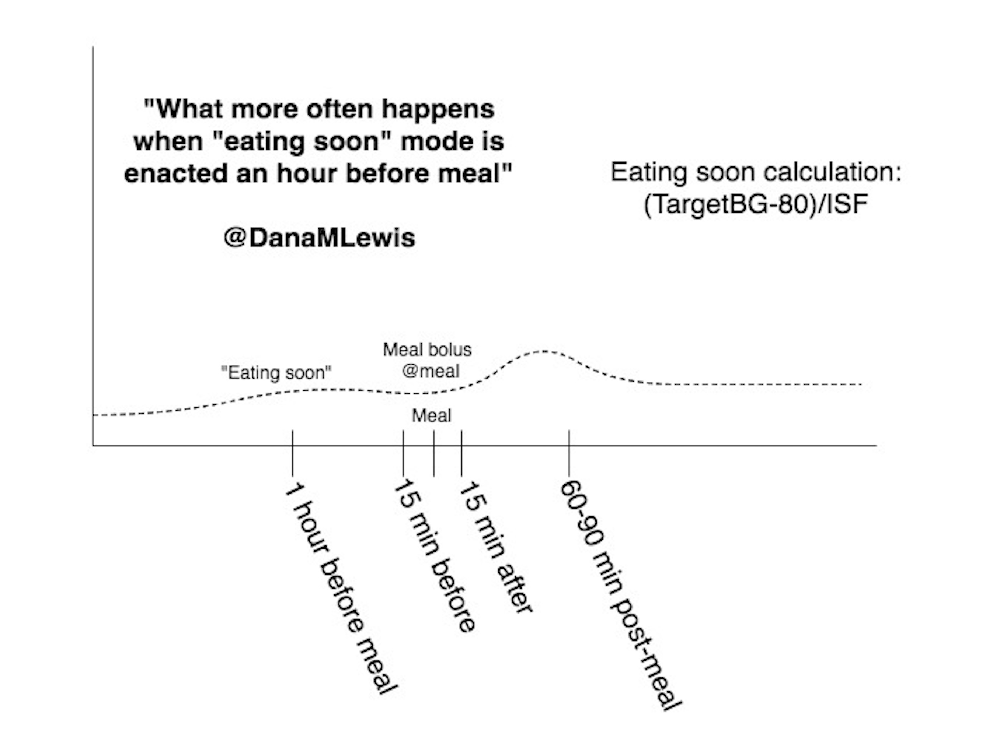

# 8. Tips and Tricks For Real Life With An APS

One of the most important things I’ve learned along the way both has to do with APS directly, because it enabled me to learn and understand it, but also applies to all individuals with type 1 diabetes, regardless of how they get their insulin injected or delivered. Namely, this is the important of understanding and tracking the timing of insulin.

## What we learned several years ago related to carbohydrates and insulin activity timing

One of the most common strategies for trying to better match insulin timing with meals and food-related activity is the “pre-bolus”. The definition varies, but when people say “pre- bolus” they usually mean taking some or all of your necessary meal insulin prior to the meal. That could be a recommended 15 minutes prior, or up to an hour prior. This recommendation evolved because we know it takes a while \(60+ minutes\) for insulin to peak, whereas food will impact BG levels within about 15 minutes. Such pre-boluses do help somewhat in preventing large spikes in BG immediately after meals, but in my experience an 80-point BG rise \(from 80 mg/dL to 160 mg/dL, for example\) is still common for meals consumed “on an empty stomach” with little or no extra insulin on board \(IOB\) prior to the pre-bolus. Pre-bolusing can contribute to dangerously low BG \(hypoglycemia\) if a meal is delayed or if you end up eating fewer carbs than expected. But we’ve learned a few things in the last years because of our experiences watching the data as we tested first DIYPS and then OpenAPS that has enabled us to develop another strategy for minimizing post-meal spikes.

#### Here’s the detailed explanation of what we learned. 

\(If you’d like a shorter and visual explanation, skip to the next section.\)

When carbohydrates are consumed, as part of a meal or snack, or to correct a low-blood-glucose \(BG\) situation, it causes BG to rise, but that rise is both delayed and gradual. In developing DIYPS’ model, we discovered that for n=1, there is a delay of approximately 15 minutes between carb consumption and when BG starts to rise as displayed on a typical CGM.

In addition, we discovered that the rate at which BG rises after carb consumption is fairly constant, both across food types and over time. For n=1, we observed that carbohydrates are digested and absorbed at a rate of approximately 30g/hour \(0.5g/minute\), and that this rate is relatively constant beginning after the initial 15-minute lag, and lasting until the last of the carbs are absorbed \(up to 4 hours later, in the case of a large 120-carb meal\).

We also observed that, for real-world meals, glycemic index \(GI\) doesn’t matter much for carb absorption rate. Our initial testing was performed on high-GI foods used to correct low BG \(juice and Mountain Dew\) and a milkshake consumed without corrective insulin while participating in an unrelated clinical trial \(to try to detect any endogenous insulin production, which was not present\). However, in subsequent real-world use of DIYPS, we’ve observed the same for almost all meal types. It seems that for meals containing at least some sugar, starch, or other highly accessible form of carbohydrates, the body seems to begin digesting and absorbing the most accessible carbs immediately, and is able to break down low-glycemic-index carbohydrates by the time the higher-GI foods are absorbed.

We also observed that the level of insulin activity at the start of a meal matters a great deal in determining whether BG rises significantly as the meal carbs are absorbed by the body. This actually matters more than the starting level of BG \(e.g. having active insulin matters more than you being 80 mg/dL compared to 140 mg/dL\). It’s not IOB, but insulin activity that matters. We learned this by studying the differences in post-meal BG rises from empty-stomach meals, and meals where there was some insulin activity happening over the past few hours \(from BG corrections or a prior meal period\).

Why is this the case? Our theory is that the liver needs insulin when the carbs first hit. When carbohydrates are initially absorbed by the small intestine, they are directed into the portal vein and pass through the liver before reaching the rest of the body’s circulatory system. The liver is designed to absorb any excess glucose out of the blood at that point, storing it for later release. The mechanism by which the liver does so is dependent on two factors: the presence of higher glucose levels in the portal vein than in general circulation \(indicative of ongoing carb absorption\), and the presence of sufficient active insulin. If enough insulin is fully active, the liver can absorb ingested carbs just as fast as they can be absorbed from the intestine. If not, then the glucose passes through the liver into general circulation, and cannot be subsequently absorbed by this mechanism, but must be absorbed later by peripheral tissues once insulin levels get high enough.

Therefore, a 15 minute pre-bolus isn’t enough for getting the insulin fully active in time. Even fast-acting insulin does not reach peak activity for 60-90 minutes after injection, since it must be absorbed through subcutaneous tissue into the bloodstream. This means that if no insulin is on board from previous boluses, the pre-bolus insulin doesn’t really kick in for 30 minutes or more after the start of the meal. In the time it takes pre-bolus insulin to kick in, the body might absorb 15-20g of carbohydrates, resulting in a 60-80 mg/dL rise in BG.

To adjust for this, we needed to find a way to provide insulin even sooner than a typical pre-bolus. But how would you do that safely, without causing low BGs before or after the meal? The best way we’ve found to do this is to do a tiny and early pre-bolus about an hour prior to a meal. We calculate the size of the early pre-bolus based on the current BG, by determining how much insulin we can safely add and still stay above 80 mg/dL for 1-2 hours. In our case, that means assuming that up to 75% of the insulin activity will occur before the meal carbs kick in. So for a BG of 110 mg/dL an hour prior to the meal, and a correction ratio of 40 mg/dL per unit of insulin, it would be safe to bolus 1 unit of insulin. That 1 U then ramps up to peak activity right at mealtime, and largely prevents any substantial rise in BG immediately after the meal.

Your mealtime bolus then needs to be adjusted to take into account the IOB. You also don’t want to bolus for more carbs than your body can absorb before that insulin hits. For example, a large meal with 90g of carbohydrates would take ~3 hours to absorb, but insulin activity often peaks after 60-90 minutes. If you have a large meal, you might decide to bolus at mealtime for only the first 30g of carbs initially \(minus any prebolus\), since those will be absorbed over the first 60 minutes. If the meal totals 60g of carbs, you will then want to bolus for the next 30g of carbs over the next hour, possibly via a continual delayed \(“square wave”\) bolus, or by doing one or more manual bolus\(es\) after the meal is over. Or at least - that’s what you would do in manual mode. With your APS, you should be able to do your first bolus, enter your carbs, and let the system take care of the rest.

## How to do “eating soon” mode

With an APS, you have an even easier way to do “eating soon” and increase your pre-meal insulin activity. All you need to do is set a lower than usual target for your APS, and it will adjust your insulin accordingly. For many people who run a typical 100 mg/dL “usual” target, they may set an 80 mg/dL target for 60 minutes prior to eating. Even thirty minutes ahead of time can help. Remember, it’s not about the amount of insulin - any insulin activity peaking will help reduce a post meal rise. Additionally, if you’ve been running on the lower end of your range for several hours, this will make an even bigger difference and blunt the likely spike that will happen when you eat carbs and they hit a bloodstream that has not had insulin active for a long time.

If you’re not yet on an APS, you can still take advantage of this strategy:

1. If you know you’re going to eat sometime in the next hour, manually calculate a correction bolus with a target BG of 80, assuming only 3⁄4 of the insulin you give will take effect by the time you begin to eat. \(Example – if your correction ratio is 1:40, and you are currently 110 mg/dL, that means you would use 30 \(3⁄4 \* 40\) to calculate that you need to give yourself 1U of insulin.\) You can give this an hour, 45 minutes, or 30 minutes prior to the meal – whatever you make work is better than not doing it!

2. Eat your meal and bolus normally, but use your IOB as part of your meal calculation so you don’t forget about that insulin you already have going. \(It’s best if your pump or APS tracks IOB and you can use a bolus calculator feature, but if you take injections, keep in mind about the insulin you’ve already given for the meal – just subtract that amount \(1U in above example\) from what you’d otherwise inject for the meal.\)

Note: if you use eating soon mode, you might want to delay the last unit or two of your meal insulin until after you see BGs rise, since sometimes you need less total insulin for the meal if you get insulin active early. This is especially true for people who haven’t tested their settings in years, and are in manual mode. Often, we PWDs may overcompensate with more insulin than we need because it’s not timed correctly compared to the carb absorption rate. Be careful as you experiment with adjusting your bolusing strategies and improving your peak insulin activity time.

#### Here’s a concrete example of manual-mode “eating soon”:

5pm – You’re planning to eat around 5:30 or 6pm. Your BG is 110 and your correction ratio is 1:40. Setting your correction target to 80 and applying the 3⁄4 ratio, that means you take 1U of insulin.

6pm – You sit down to eat. Looking at your meal, you see 45 carbs and decide, with a carb ratio of 1:10, that you would take 4.5 units for the meal. Keeping in mind your earlier bolus of 1U, you end up taking 3.5 units for the meal. \(4.5U total – 1U prebolus = 3.5 more units needed to cover the meal, see above note about considering delaying a unit or two of that bolus until you see your BGs impacted by carbs\).

You should have less of a spike from your carbs kicking in 15 minutes after you eat. It won’t always completely eliminate a spike \(you can still be wrong on your carb count, etc.\), but it will provide a flattening effect and reduce the spike that otherwise would have occurred.

And here’s a visual of what often happens:

And a visual of ideally what happens with an “eating soon” mode, manually or via a target on your APS:

Again, APS users will find it easier to change their target in advance of the meal. If your system is interoperable, you can use things like Google Calendar and IFTTT to adjust your targets ahead of time - including planning an “eating soon” target at different times during the work or school week when you may be more likely to forget otherwise. For example, some families set up a Google Calendar so they can pre-plan target adjustments for the entire weeks’ worth of gym class and lunch times. If your system does not allow pre-planned target changes, or temporary target changes, you can still achieve a similar outcome by doing the manual version of “eating soon” to optimize your insulin activity timing relative to your meals.

## Changing your pump sites more effectively

In addition to CGM sensors, pump sites are the other “weak link” in your APS. They can get ripped out, they can stop working, and sometimes even on insertion they just don’t appear to work... or it takes hours before it seems like the insulin takes effect. It can be incredibly frustrating.

Similarly to “soaking” new CGM sensors, I’ve developed a practice and changed how I change my pump sites, whenever possible.

**What I used to do \(i.e. for 12+ years\):** 

* Pull out pump site 
* Take shower 
* Put in new pump site

If the pump site didn’t work, spend all night high, or the next hours high while I debated whether it was just “slow” or if I needed a second new site. Ugh.

**What I decided to start doing and have done ever since \(unless a site gets pulled out by accident\):**

* On the day that I decide to change my pump site, I do not take my “old” pump site out before my shower.
* After my shower, I leave in the old pump site and put the new pump site on. Which means I am wearing TWO pump sites.
* I put the tubing on the new site etc. as expected. But because I have the old site on, if I start to see BGs creep up an hour or two later, I can do one of two things:
  * Swap the tubing back to old site, give a bolus or a prime on the old site, then switch tubing back to new site. \(I do this if I think the new site is working but seems “slow”\)
  * Swap the tubing back to old site, remove the new site, and then insert a second “new” site \(or wait until the next morning to do so when I feel like it. 
* Otherwise, if BGs are fine, I pull the “old” site out once I confirm the new site is good to go.

The other reason why you should consider keeping the old site on for a while is if you’ve recently given a bolus or otherwise had a lot of insulin go into the site. Sometimes, if you remove your pump site, you’ll see insulin spill out. This can occur even if the site wasn’t “occluded”. So you actually didn’t “get” some of that insulin, which can lead to a high within a few hours, and you’ll be playing catch up from the time of the inserted new site and waiting for the new site’s insulin activity to kick in, and then playing catch up from the missed insulin that spilled out of the old site. I don’t seem to experience that problem anymore when I leave the “old” site on for a few hours after I insert the “new”/next site.

To me, it’s worth keeping the old site on for a few \(or even ~12\) hours. I know many people may not like the idea of “wearing two sites”. But it’s not wearing two sites for 3 days. And if you find yourself having a lot of post-site-change highs – that’s why and when I switched over to this approach.

## Traveling with your APS 

Have pancreas, will travel!

Just like an insulin pump, an APS can and does travel well. But one of the common questions the DIY and early adopter of commercial APS communities have seen is: what do I do when I travel? What about airport security? What about time zones and jet lag?

### Dealing with airport security

A list of diabetes gear you’re probably packing for your trip:

* BG meter
* Test strips
* Lancet\(s\)
* Pump sites
* Reservoirs
* CGM sensors
* CGM receiver
* Tape for sites/sensors
* Syringes as back up
* Anti-nausea meds
* Depending on the length of your trip, backup pump/transmitter/meter/receiver/etc.
* Snacks
* Pump
* APS \(if it’s a separate rig or controller\) 
* Insulin
* Extra insulin
* Juice for lows
* Spare batteries

Out of that list, here are the only things I would pull out of your bag when you send it through the x-ray at security.

* Insulin/extra insulin\* 
* Juice for lows\*\*


Everything else \(yes, including your CGM receiver; yes, including your pancreas rigs/APS device\) can stay in your bag and go through the x-ray.


* \*If you have a single bottle of insulin, it’s under the liquid \(3oz\) limits, so you don’t technically need to pull it out. But if you are carrying numerous bottles/pens/etc., if you have them separately bagged and can pull out separately, I would do so in order to reduce the risk of them flagging your bag for needing additional screening.
* \*\* Yes, you have a medical need for liquid and can take juice through security. HOWEVER, I \*highly\* recommend having this in a baggie and pulled out of your bag so it is separate. They’ll often pick that up, examine it, and if you say “medical liquid for diabetes”, it’s fine. Sometimes you’ll get pulled for a pat down, but not always. And, this usually prevents them from having to dig through your bags to find the juice and go through all your things. \(Which is annoying, not to mention time consuming\).

My second “HOWEVER” related to juice: I’ve stopped carrying juice for lows when I air travel. Yes, it only takes an extra couple of minutes or whatever for them to check things out, but I’d rather not have any hassle if I can avoid it. I instead have switched to Starbursts, Skittles, and similar. \(They’re super fast acting for me, and actually make it easier to do a small 4g correction vs having to bust open an entire 15g juice box that can’t really be saved for later.\) I have those in my pocket or easily accessible in an outer pocket of the bag that will go under my seat on the plane. You can of course still carry juice, but think about if that’s really worth the hassle/effort and if there’s an alternative \(glucose tabs, small wrapped candies, etc.\) that might be easier for treating lows when traveling. YDMV, of course.

#### What about insulin pumps? Should or do you take it off?

It depends on which system you wear. My \(Open\)APS includes an insulin pump that does not alarm in 99% of metal detectors because it’s not made with lots of metal. I also have TSA Precheck, which means 95% of the time when traveling in the U.S. I am only asked to go through a metal detector. So right before I walk up to security, I take my pump that’s usually clipped to an outer pants pocket and clip it inside my waist band and underneath my shirt. If it doesn’t alarm, then I proceed like a usual traveler to get my bags and be on my way. This is also the case for most building metal detectors. However, if you have a metal-cased pump, you may want to proactively ask for a pat-down if you know it’s going to alarm every time.

* If I am randomly selected by the metal detector to instead go through the body scanner:
* If you wear your pump into the body scanner, the system will likely flag it, and agents will likely want to do a pat-down anyway.
  * The radiation dosage from a properly functioning backscatter x- ray is tiny: lower than the background radiation you’re exposed to every 2 minutes of your life, or every 12 seconds on a plane. There are no guarantees that the body scanners will always be functioning properly and won’t break your pump, and a pretty high likelihood that if you go through the scanner you’ll still need a pat-down as well. So if you have a super special limited edition rare pump that does a special thing \(like those that enable you to DIY closed loop\), as I do, it may make you decide that just a pat down is better than a scan plus pat-down, since if it DOES break due to a malfunctioning scanner, TSA sure isn’t going to pay to fix it/get you a new one, and a new one wouldn’t allow you to DIY closed loop anyway. If you have a commercial APS, you should ask the manufacturer what their recommendations are for body scanners.
* So, if I get randomly selected, I stop right there and say “opt out”. Say it to whoever is pointing you over to the body scanner, they’ll possibly read you a script to confirm you want to opt out, and just keep saying “yes, I opt out” and “that’s fine” to the “but then you have to have a pat down!”. They’ll order up a same-gender TSA agent who will come get you, escort you around the body scanners, and you’ll get your pat down. The usual applies – if you want, you can ask for a private area for your pat down. I usually don’t care, but if you do, make sure you keep an eye on your bags and ask for those to come with you so they’re not left out in the open for anyone to accidentally take. \(They’re usually pretty good about that, though.\)
* For the pat down, they’ll ask you about sensitive areas/medical devices. This is the time to point out your pump: tell them \(pat the area\) where it’s connected, and pat/point out your CGM sensor if you have one. They’ll be extra careful then to not accidentally catch their hands on those areas.
* At the end, they’ll go swab their gloves, then come back and ask you to pat/touch your pump and then let them swab your hands.

If you don’t have Precheck, the above will likely happen every time. So if you’re an opt-out-of-body-scanner-type and travel more than 2 times a year... Precheck is probably worth the money if you can afford it. \(And think about getting Global Entry, which comes with Precheck included, and also gets you expedited return to the country after traveling abroad\).

If you have a metal-cased pump \(or any other pump, and just want this instead of the metal detector or the body scanner\), you can ask for a hand inspection of your pump/APS. Different manufacturers say different things about whether x-ray and body scanners are ok/not ok, so check with them and also go with your gut about what you’d like to do with your pump.  
Keep in mind that the radiation your carry-on luggage gets from the hand-luggage x-ray is many times higher than what your body gets from a backscatter x-ray, so if you’re concerned about x-ray radiation damaging your pump, it should not be sent through the scanner with your carry-on luggage.

#### What about a doctor’s note?

I have never carried a doctor’s note, and have not had an issue in the 14+ years I’ve been flying with diabetes – including in dozen of international airports. YDMV, and if you’d feel more comfortable with one, you can get one from your doctor. But for what it’s worth, I don’t travel with one. I’ve never had an issue in any country in the world explaining even my DIY-APS components, insulin pump, or CGM.

#### What about international airports?

The only thing to know about international airports is they have similar guidelines about liquids, so plan to also pull out your juice and toiletries from your bag. Same rules apply for keeping rigs, supplies, etc. in your bag otherwise. I’ve never had an issue based on pancreas rigs internationally, either. They’re small computers and batteries, so both TSA and international security are used to seeing those come through in the x-ray.

## Time zones and jet lag

If you’re changing time zones when you travel, you have a few options. If you are traveling briefly, or only across a couple of time zones, and would not normally feel the need to adjust the timing of your basals, then you may not want to bother adjusting your devices’ time zones. But, if you would like to adjust to the new time zone \(perhaps for a longer trip or a move\), you can adjust your APS’s clock. I recommend planning to do this when you have some extra time for troubleshooting, in case you have issues. It may be confusing if you have to change your CGM separately from your APS, or if your CGM automatically updates to match your phone but your APS does not change its time. Or, it may not matter to you at all - especially if you typically have a relatively flat basal schedule throughout the day and don’t see much variation in insulin needs.

More importantly, it’s worth noting that your body only changes about an hour or so of time zone a day, so even if you go abroad, there’s not a rush to change time zones/the time on your APS - you can wait until 2-3 days into your trip to make the swap. Even if you’re jumping ahead 8 or 12 hours of time zones, it will take your body a while to catch up. The changes from being off-shifted from your typical underlying basal pattern will be minor; the bigger changes that the APS will be handling will be the jet lag, sleep deprivation, activity change, and likely food changes from your travel.

## Don’t forget your emergency backups!

Regardless of the risk from x-ray or body scanner, stuff happens. Murphy’s law says it will happen when you travel. Remember to read up in advance and know what your options are for taking or getting a replacement APS on your trip \(if possible, and if something breaks that you can’t resolve\), and have enough supplies to fall back to standard pumping or MDI if necessary.

