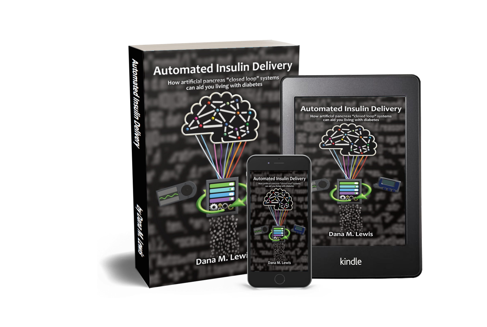

# Automated Insulin Delivery

Automated insulin delivery is a technology for managing type 1 diabetes that goes by many names: hybrid or full closed loop, artificial pancreas system \(APS\), “looping”, and more. But whatever you call them, automated insulin delivery systems are not all the same. You have choices, ranging from the type of insulin pump body and CGM you want to use, to the algorithm and controller, to the interoperability and remote monitoring options, and more. Like switching from multiple daily injections to an insulin pump, switching from manual diabetes to automated insulin delivery has a learning curve.

It’s certainly one you can tackle. After all, you’re already tackling type 1 diabetes! You already have the base knowledge and experience you need to succeed with a closed loop system, if it’s right for you. But you might be wondering how to get ahead of your learning curve before you start or even choose an APS. Or maybe you’ve started and want to dig even deeper into optimizing how an automated insulin delivery system fits into your lifestyle. This book was written for you! It leverages the collective knowledge of the early adopters of do-it-yourself and commercial systems from the past five years and packages it into easy, understandable guides and lessons learned.

In this book, you’ll find new analogies to help you understand – and explain – this new method of diabetes management, and tips on how to communicate with your healthcare provider\(s\) about it. You’ll see stories and examples from real families and individuals living with type 1 diabetes and how they benefit from artificial pancreas systems, and why they chose and continue to choose to use them. You’ll be empowered to understand the basic components of artificial pancreas systems, how they work, and what questions to ask as you evaluate your choices and learn how best to integrate them into your lifestyle.


A traditional, physical “book” format - a physical, printed book that’s available through self-publishing. It’s priced so that every 2 copies purchased will fund an author-priced copy that I will donate to hospitals, libraries, etc. You can find it here on Amazon.



An “e-book” format - a version that can be downloaded to your Kindle. [You can find it here on Amazon](https://amzn.to/2DGzUwC).



A PDF format - which you can download for free and read on your computer or other e-reader of choice. [Click here to go to the download page. ](download.md)



A website \([this site](./)!\)- so you can review portions of the content anytime, and see any changes over time. There will also be additional links and videos with more content. The website and its content are open source, so if you see any typos or have suggestions, you can make those suggestions or edits directly!   
  
_\(To keep reading the web version, just hit the "Next" button below.\)_


