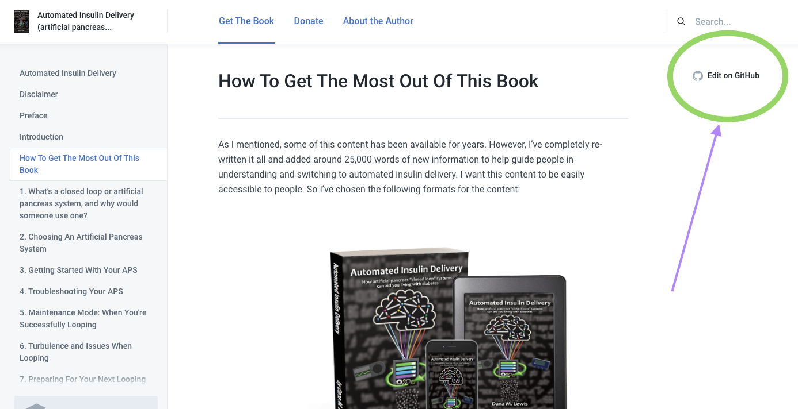
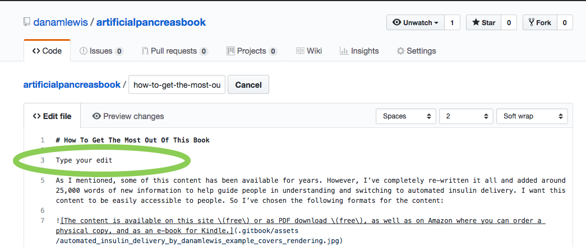
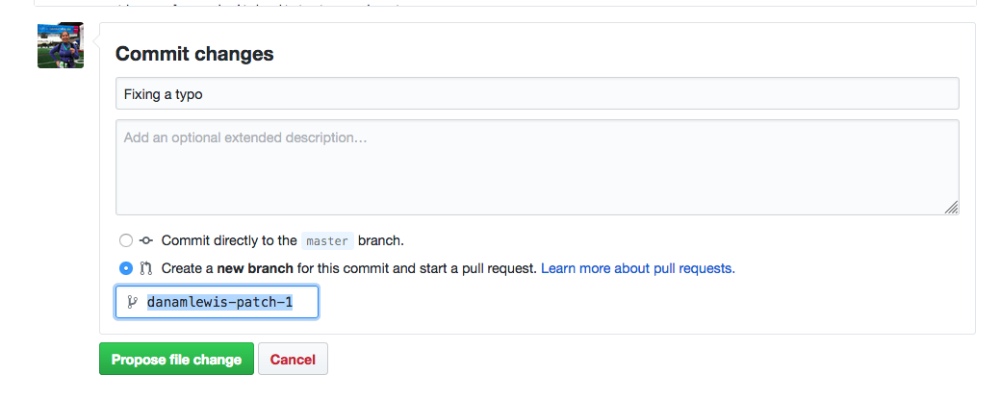
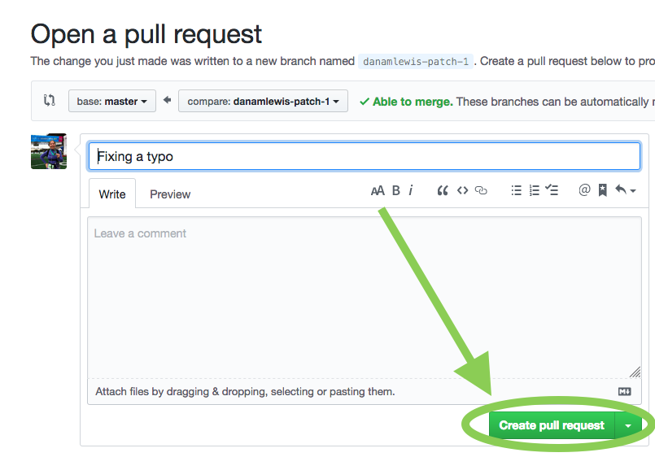

# Help edit this book!

Find a typo, or have a suggestion for content to add?

The book is stored on Github, which makes the content available for pull request \(i.e. a suggested edit\). Please note that any submitted edits will be accepted and rolled into the book with the same license as the rest of the content \(CC BY-NC-SA 4.0\). 

## Make an edit to fix a typo or broken link

To make a PR, you can click on any page where it says "Edit on Github" and it will take you to the page where the content lives. 

Sign up or login to Github. Then, click the pencil icon in the top right corner. 

Make your edit.

Then scroll down, create a subject line \(if you leave it blank, it will default, and that's fine, too\). Then click the green button and follow the green button trail to submit the PR. 

I'll get a notification to review your suggested change and can incorporate it! Thanks for helping improve the book! 

## Suggest new content

Is there something you think should be added to the book in the future? [Click here to submit your suggestion](https://github.com/danamlewis/artificialpancreasbook/issues/new/choose)! Thank you.

