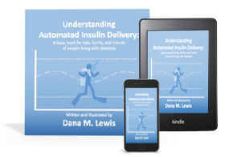

# Resources

For a narrated video to explain the basics of automated insulin delivery technology, check out [this free video](https://bit.ly/39Paa1O) that uses an analogy of scuba diving to help explain to kids or others with less experience of diabetes. It's also available in [print](https://amzn.to/3tqJHza) or [Kindle](https://amzn.to/39MzCVE) book forms.

Here are some of the resources discussed throughout the book, and other helpful references:

#### Documentation for a few different DIY diabetes projects:

* Nightscout: [https://nightscout.github.io/](https://nightscout.github.io/)
* OpenAPS: [http://openaps.readthedocs.org/en/latest/](http://openaps.readthedocs.org/en/latest/)
* AndroidAPS: [https://androidaps.readthedocs.io/en/latest/](https://androidaps.readthedocs.io/en/latest/)
* Loop: [https://loopkit.github.io/loopdocs/](https://loopkit.github.io/loopdocs/)

#### Related Facebook Groups:

* “Looped” \(supports all types of DIY closed loop systems\): [https://www.facebook.com/groups/TheLoopedGroup/](https://www.facebook.com/groups/TheLoopedGroup/)
* “CGM In The Cloud” \(supports Nightscout-related questions\): [https://www.facebook.com/groups/cgminthecloud/](https://www.facebook.com/groups/cgminthecloud/)
* “CGM In The Cloud Off Topic” \(supports all other diabetes-related topics and other tech question\): [https://www.facebook.com/groups/CGMITCOFFTOPIC/](https://www.facebook.com/groups/CGMITCOFFTOPIC/)

## Research referenced:

* Meta-analysis article \(Tsapas et. al, BMJ\): [https://www.bmj.com/content/361/bmj.k1310](https://www.bmj.com/content/361/bmj.k1310)
* “Excellent Glycemic Control Maintained by Open-Source Hybrid Closed-Loop AndroidAPS During and After Sustained Physical Activity” \(Petruzelkova et al\): [https://www.liebertpub.com/doi/10.1089/dia.2018.0214](https://www.liebertpub.com/doi/10.1089/dia.2018.0214)
* “Glycemic Control in Individuals with Type 1 Diabetes Using an Open Source Artificial Pancreas System (OpenAPS)” (Melmer et al): https://dom-pubs.onlinelibrary.wiley.com/doi/10.1111/dom.13810
* “Efficacy, safety, and user experience of DIY or open-source artificial pancreas systems: a systematic review” (Asarani et al): https://link.springer.com/article/10.1007%2Fs00592-020-01623-4
* “In Silico Trials of an Open-Source Android-Based Artificial Pancreas: A New Paradigm to Test Safety and Efficacy of Do-It-Yourself Systems” (Toffanin et al): https://www.liebertpub.com/doi/10.1089/dia.2019.0375
* “A real-world study of user characteristics, safety and efficacy of open-source closed-loop systems and Medtronic 670G” (Jeyaventhan et al): https://dom-pubs.onlinelibrary.wiley.com/doi/10.1111/dom.14439?af=R
* “Use of a do-it-yourself artificial pancreas system is associated with better glucose management and higher quality of life among adults with type 1 diabetes” (Wu et al):https://journals.sagepub.com/doi/10.1177/2042018820950146
* “CREATE (Community deRivEd AutomaTEd insulin delivery) trial. Randomised parallel arm open label clinical trial comparing automated insulin delivery using a mobile controller (AnyDANA-loop) with an open-source algorithm with sensor augmented pump therapy in type 1 diabetes” (Burnside et al): https://link.springer.com/article/10.1007%2Fs40200-020-00547-8
* “Open-Source Automated Insulin Delivery in Type 1 Diabetes” (Burnside et al, New England Journal of Medicine in 2022): https://doi.org/10.1056/NEJMoa2203913
* “Extended use of an open-source automated insulin delivery system in children and adults with type 1 diabetes: The 24-week continuation phase following the CREATE randomized controlled trial” (Burnside et al, Diabetes Technology and Therapeutics, 2023): https://doi.org/10.1089/dia.2022.0484
* “First Use of Open-Source Automated Insulin Delivery AndroidAPS in Full Closed-Loop Scenario: Pancreas4ALL Randomized Pilot Study” (Petruzelkova et al, 2023): https://doi.org/10.1089/dia.2022.0562
* “Hybrid Closed Loop Using a Do-It-Yourself Artificial Pancreas System in Adults With Type 1 Diabetes” (Nanayakkara et al, 2023): https://doi.org/10.1177/19322968231153882
* All the DIY studies mentioned otherwise are linked from [OpenAPS.org/outcomes](http://OpenAPS.org/outcomes)

## Blogs covering living with APS:

* Dana Lewis: [https://DIYPS.org/](https://DIYPS.org/)
* Tim Street: [http://www.diabettech.com/](http://www.diabettech.com/)
* Mary Anne Patton: [https://myartificialpancreas.net/](https://myartificialpancreas.net/)

## Videos about APS







